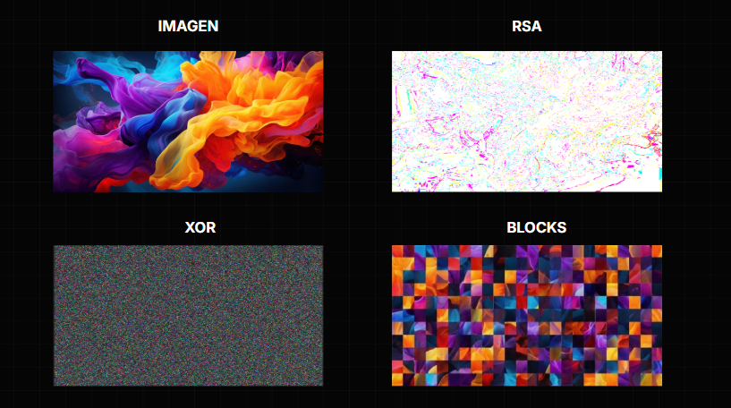

<h1 align="center">🔐 Desarrollo y Aplicación de Algoritmos de Cifrado en la Seguridad Informática</h1>

  

### 📝 Descripción
Desarrollo de un sistema de seguridad criptográfica diseñado para proteger activos digitales visuales. El proyecto implementa un enfoque híbrido que transforma imágenes legibles en **ruido aleatorio**, garantizando que la data sea irrecuperable sin la llave privada correspondiente.

### ⚙️ Resumen Técnico
El sistema opera mediante tres capas de seguridad complementarias:

* ✅ **RSA (Asimétrico):** Garantiza el intercambio seguro de las llaves utilizadas para el cifrado, protegiendo el canal de comunicación.
* 🧱 **Permutación de Bloques:** Divide la imagen en cuadrantes y redistribuye los píxeles aleatoriamente para **romper la correlación espacial** (destruye formas y contornos).
* ⚡ **Cifrado XOR:** Aplica una operación bit a bit sobre cada píxel para ofuscar los valores RGB, eliminando la información de color y aplanando el histograma.

### 📉 Resultado y Validación
El proceso elimina eficazmente tanto la estructura visual (posición) como los patrones de color. Las métricas de análisis confirman una alta resistencia a ataques estadísticos, resultando en una imagen final indistinguible del ruido estático.

  <em>Comparativa: Imagen Original vs. Cifrado Final (Ruido)</em>
  
   

---
### 🛠️ Tech Stack
• **Lenguaje:** Python • **Cifrado:** Cryptography & Random • **Análisis:** Microsoft Power BI • **Viz:** Matplotlib
